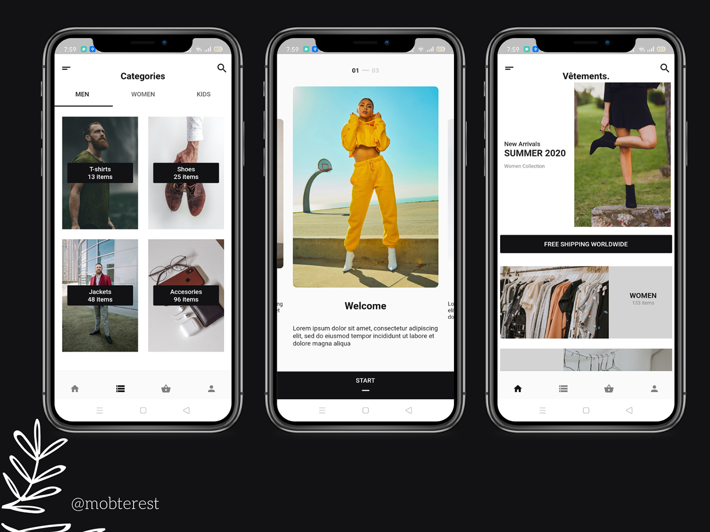

# E-commerce App

## Introduction

Built with [Flutter](https://flutter.dev/) :star2:



## Features

 - Lets one buy different fashion trends online and pay right from the app. 
 - It displays different categories and a shopping cart with a checkout functionality.

## Feedback

- Feel free to send feedback . Feature requests are always welcome. If there's anything you'd like to chat about, please don't hesitate to [reach out](https://www.instagram.com/mobterest/).

## Build process

- Follow the [Flutter Guide](https://flutter.dev/docs/get-started/install) to get started in building with Flutter.
- Clone or download the repo.
- Run ``` flutter pub get ``` to install the necessary packages on your command line that's navigated to the root of the project.
- Invoke the ``` flutter run ``` command.

## Acknowledgements

Thanks to [Flutter](https://flutter.dev/) and [Visual Studio Code](https://code.visualstudio.com/) for supporting us with amazing products.